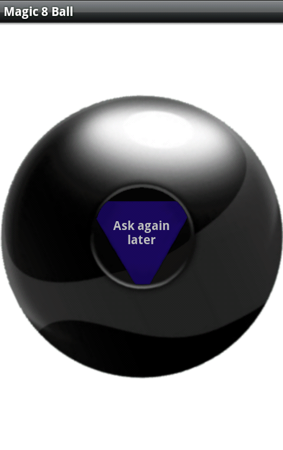

# Magic Ball - training ruby project

## Magic 8 ball

## Table of contents
* [General info](#general-info)
* [Technologies](#technologies)
* [Setup](#setup)
* [Status](#status)

## General info

[Статья в Википедии](https://ru.wikipedia.org/wiki/Magic_8_ball) 

> Magic 8 ball (рус. магический шар 8); также mystic 8 ball, шар судьбы, шар вопросов и ответов, шар предсказаний — игрушка, шуточный способ предсказывать будущее.
	
## Technologies
Ruby

## Setup
To run this project, install the Ruby, save project locally using:

```
$ git clone 
$ cd ../lorem
$ ruby magic_ball.rb
```
## Status
This is my training ruby project.

## Inspiration
Add here credits. Project inspired by..., based on...

## Contact
Created by [Rob Bikmansurov](mailto: robb@mail.ru) - feel free to contact me!
